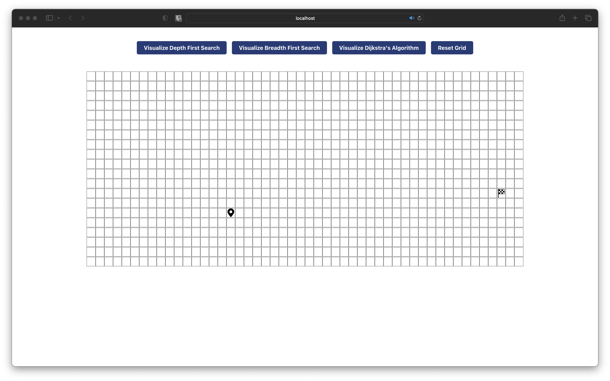
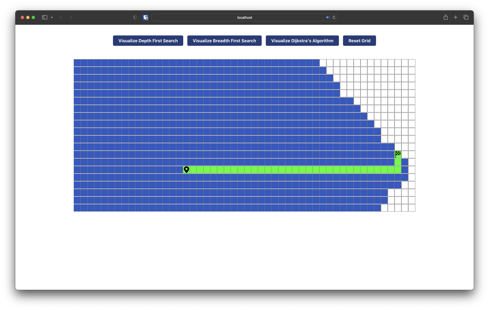
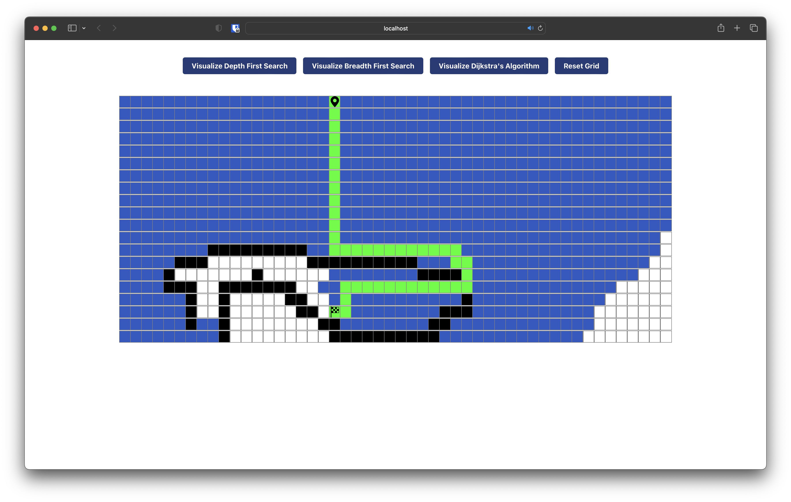
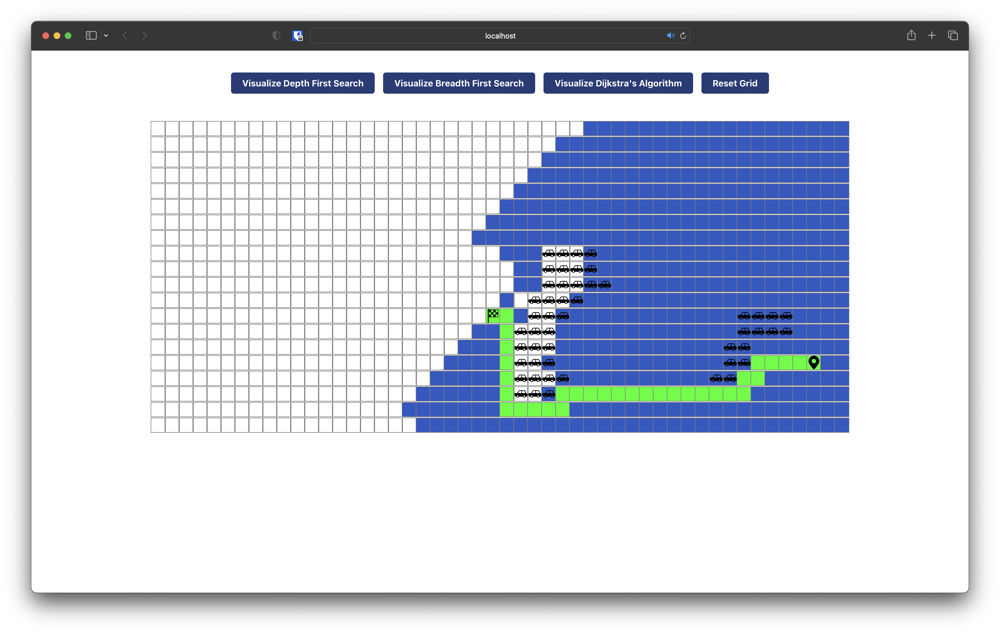
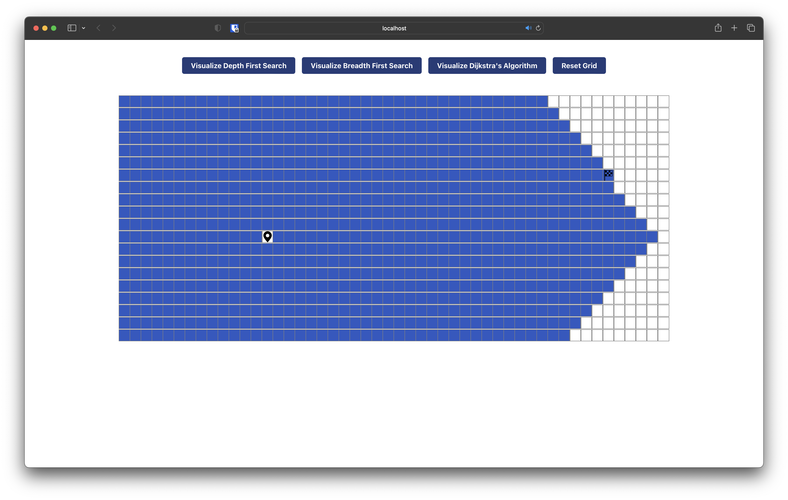
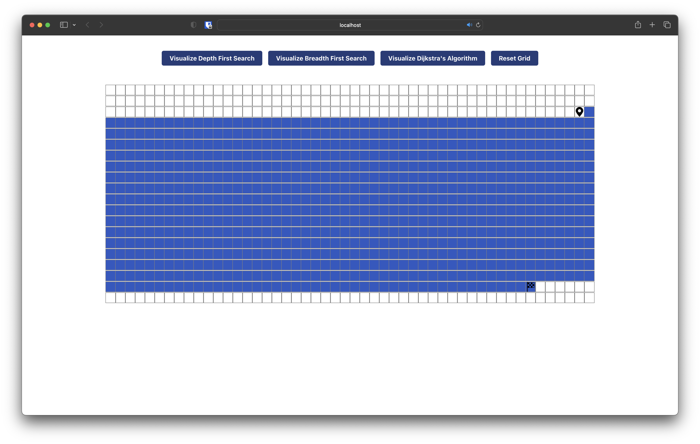

# Dijkstra Visualizer

**Conteúdo da Disciplina**: Grafos 2

## Alunos

| Matrícula  | Aluno                        |
| ---------- | ---------------------------- |
| 19/0016663 | Lucas Pimentel Quintão       |
| 20/0017519 | Eurico Menezes de Abreu Neto |

## Sobre

Este repositório contém um algoritmo de busca de caminho em um grid implementado em JavaScript, utilizando os algoritmos Dijkstra, BFS e DFS. É possível adicionar pesos no grid e também colocar paredes para bloquear o caminho.

O algoritmo é baseado em grafos, onde cada célula do grid é um nó e cada célula adjacente é conectada por uma aresta. O ponto de partida e o ponto de chegada no grid são definidos aleatoriamente e o algoritmo irá encontrar o caminho mais curto entre eles, levando em consideração os pesos e as paredes.

O projeto foi pensado para ter uma interface simples e intuitiva, que fosse de fácil uso e demonstrasse a execução dos algoritmos e suas interações com os pesos e paredes do grid.

## Screenshots

<figcaption align='center'>
    <b>Figura 1: Grid Inicial</b>
</figcaption>

<figcaption align='center'>
    <b>Figura 2: Dijkstra's Algorithm</b>
</figcaption>

<figcaption align='center'>
    <b>Figura 3: Dijkstra's Algorithm rodando com paredes</b>
</figcaption>

<figcaption align='center'>
    <b>Figura 4: Dijkstra's Algorithm rodando com pesos</b>
</figcaption>

<figcaption align='center'>
    <b>Figura 5: Breadth First Algorithm</b>
</figcaption>

<figcaption align='center'>
    <b>Figura 6: Depth First Algorithm</b>
</figcaption>

## Instalação

**Linguagem**: JavaScript, CSS e HTML

**Framework**: React

Para rodar o projeto, tenha o node instalado e rode os seguintes comandos:

`npm install`

`npm start`

## Uso

Esse projeto, tem a finalidade de demonstrar o funcionamento alguns algoritmos de busca e destacar o menor caminho. Além dos algoritmos, temos algumas outras funcionalidades para deixar o software mais interessante, como a possibilidade de adicionar pesos segurando a tecla "W" e clicando nas células desejadas, que deixam o caminho mais lento para o algoritmo Dijkstra, também é possível adicionar paredes segurando e arrastando o mouse no grid, pelo qual o algoritmo terá que contornar para chegar ao fim.

## Outros

Quaisquer outras informações sobre seu projeto podem ser descritas abaixo.
